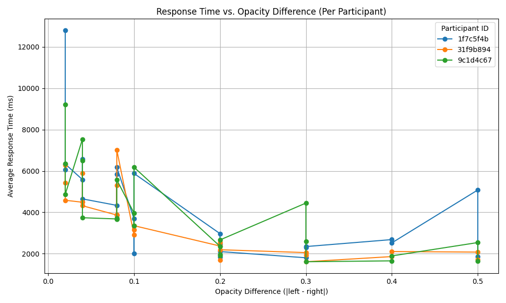
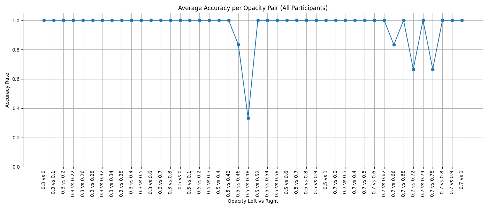

# Opacity Judgement Study Visualization

This project processes and visualizes user response data from an opacity judgment experiment. In each trial, participants were shown two images with the same content but different opacity levels (e.g., 0.5 vs 0.46) and asked to choose the one with higher opacity.

The script **opacity_results.py** generates three types of visualizations based on user responses, durations, and accuracy.

**Version**: April 15, 2025, by Shano Liang

---

## 📊 Output

1. **response_time_vs_opacity_diff.png**
Average response time vs. opacity difference, shown separately per participant.



2. **response_time_per_opacity_pair.png**
Average response time for each specific opacity pair (e.g., 0.5 vs 0.6), shown separately per participant.


3. **accuracy_per_opacity_pair.png**
Average accuracy (proportion of correct responses) for each opacity pair, aggregated across all participants.



## 📂 Input

- **CSV File:** `basic-questionnaire-study_all_tidy.csv`  
  This file should contain the experiment data including:
  - `participantId` – Unique ID of each participant
  - `trialId` – Trial identifier
  - `answer` – User's response (`"Left Image"` or `"Right Image"`)
  - `duration` – Time taken to make the selection (in milliseconds)
  - `correctAnswer` – A JSON-formatted string containing:
    - `"opacity_left"` – Opacity of the left image
    - `"opacity_right"` – Opacity of the right image

Place the CSV file in the same directory as the script.

## ▶️ Usage

1. Ensure you have Python 3 installed.
2. Install required package (if not already):

   ```bash
   pip install matplotlib pandas

## Run the script
    ```bash
    python opacity_results.py

